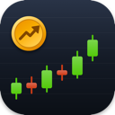
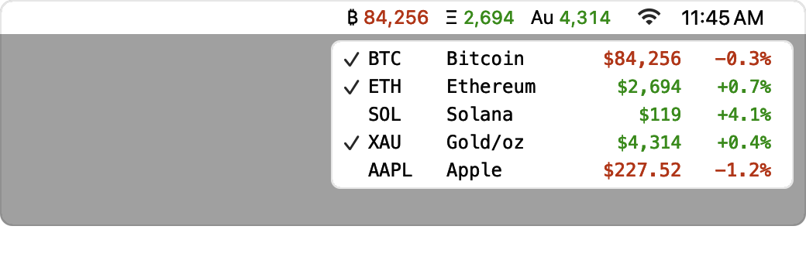

<p align="center">
  
</p>

<h1 align="center">Tickado</h1>

<p align="center">
  Live prices for crypto, stocks, ETFs and precious metals – right in your Mac's menu bar.<br>
  <a href="https://github.com/achirus-code/Tickado/releases/latest"><b>Download</b></a> ·
  <a href="https://achirus-code.github.io/Tickado/">Website</a> ·
  <a href="#deutsch">Deutsch</a>
</p>

<p align="center">
  <picture>
    <source media="(prefers-color-scheme: dark)" srcset="docs/preview-dark.png">
    
  </picture>
</p>

Tickado is a small native macOS app that lives in the menu bar – no Dock icon, no browser tab. It shows the
values you pick, colored green or red by their 24-hour change. Click the ticker to see all your values with
price and change at a glance.

- **Four asset classes** – cryptocurrencies, stocks and indices, ETFs, and gold, silver, platinum and palladium, mixed freely.
- **No account needed** – works right after download. Prices come from CoinGecko and Yahoo Finance.
- **Native and lightweight** – AppKit, no Electron, no background services, no tracking.

## Features

### Menu bar
- **Three ticker modes:** all checked values side by side, one value rotating every 5 seconds, or compact with two rows and ▲▼ arrows.
- **Display options:** coin signs instead of symbols (₿, Ξ, Au), currency sign, 24h change, only the 24h change without the price, abbreviated large prices (84.2K).
- **Smart number format:** significant digits instead of fixed decimals (84,150 · 1.53 · 0.0398), adjustable from 2 to 6.
- **Color themes:** green/red, red/green, blue/orange for color blindness, or monochrome.
- **Offline aware:** stale prices turn gray, and prices reload after the Mac wakes up.

### Menu
- A price list with symbol, name, price and 24h change, grouped by crypto, metals, stocks and ETFs.
- Click a value to show or hide it in the menu bar. ⌥-click opens it on CoinGecko or Yahoo Finance.

### Settings
The Settings window shows a **live preview** of your menu bar, drawn with the same code as the real one. Every
change applies instantly – there is no Save button.

| Tab | What you set there |
|---|---|
| **Display** | Values in the menu bar, ticker mode, display options, colors, precision |
| **Assets** | Pick values: top 500 coins plus search, popular US and DAX stocks, ETFs by name, ticker or ISIN, precious metals |
| **General** | Language (25 languages, follows the system by default), base currency (USD, EUR, CHF, GBP, … even BTC, ETH, sats), metal unit (troy ounce, gram, kilogram), update interval (30 s – 30 min), launch at login, optional CoinGecko API key |

## Installation

1. Download **`Tickado.zip`** from the [latest release](https://github.com/achirus-code/Tickado/releases/latest).
2. Unzip it and drag **Tickado.app** into your **Applications** folder.
3. **First launch:** right-click the app → **Open** → **Open**. This is needed once because Tickado is not notarized by Apple yet.
4. Tickado appears in the menu bar. Open **Settings…** to pick your values.

Requires **macOS 14 Sonoma or later**. Runs natively on Apple Silicon and Intel.

## Data sources and privacy

| Data | Source | Key |
|---|---|---|
| Cryptocurrencies | [CoinGecko API](https://www.coingecko.com/en/api) | Optional – a free Demo key or a Pro key gives higher rate limits. It is stored in the macOS keychain. |
| Stocks, ETFs, indices, exchange rates, precious metals | Yahoo Finance | Not needed. Metals use COMEX futures prices. |

Tickado only talks to these two services. It has no account, no analytics and no tracking. Settings are stored
locally in the app's preferences. The coin catalog is cached for a day in `~/Library/Application Support/Tickado/`.

Prices are for information only and may be delayed. Yahoo Finance is an unofficial interface and may change
without notice.

## Building from source

You only need the Xcode Command Line Tools (`xcode-select --install`) – no full Xcode.

```bash
git clone https://github.com/achirus-code/Tickado.git
cd Tickado
./build.sh            # builds Tickado.app in the project folder
./build.sh install    # builds, installs to /Applications and restarts the app
```

The project is a Swift Package (Swift 5.10, AppKit). The main parts:

| File | Purpose |
|---|---|
| `Sources/Tickado/StatusController.swift` | Menu bar item, menu, refresh timers |
| `Sources/Tickado/TickerRenderer.swift` | Draws the ticker and the menu rows |
| `Sources/Tickado/SettingsWindowController.swift` | Settings window with preview and tabs |
| `Sources/Tickado/CoinGecko.swift`, `YahooFinance.swift` | Price sources |
| `Sources/Tickado/Translations/` | UI translations, one file per language |

Releases are built by GitHub Actions: pushing a tag like `v1.1.0` builds a universal `Tickado.app` and publishes it
as a release.

## License

Tickado is open source under the [MIT License](LICENSE).

---

<a id="deutsch"></a>

## Deutsch

Tickado zeigt Kurse von **Kryptowährungen, Aktien, ETFs und Edelmetallen** direkt in der Menüleiste deines Macs,
grün bei steigenden und rot bei fallenden Kursen. Ein Klick auf den Ticker öffnet die Kursliste mit Preis und
24h-Änderung. Ein Konto brauchst du nicht.

**Installation:** [`Tickado.zip` herunterladen](https://github.com/achirus-code/Tickado/releases/latest), entpacken,
**Tickado.app** in den Ordner **Programme** ziehen. Beim ersten Start Rechtsklick auf die App → **Öffnen**, weil sie
noch nicht von Apple notarisiert ist. Danach unter **Settings…** die gewünschten Werte auswählen.

Voraussetzung: macOS 14 oder neuer, Apple Silicon oder Intel. Die Oberfläche gibt es in 25 Sprachen, auch auf
Deutsch. Mehr auf der [Website](https://achirus-code.github.io/Tickado/).

Tickado ist Open Source unter der [MIT-Lizenz](LICENSE).
